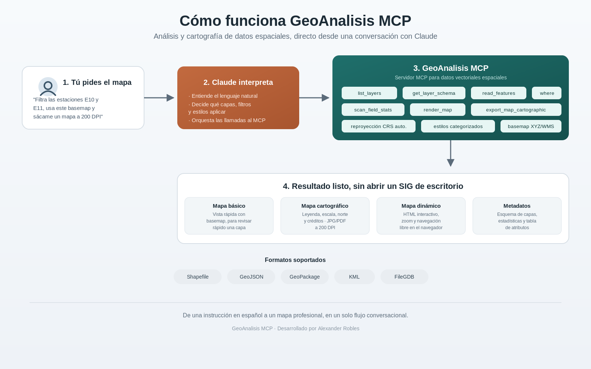

# GeoAnalisis MCP

Servidor MCP para lectura, análisis y cartografía de datos espaciales vectoriales, integrado con Claude Desktop. De una instrucción en lenguaje natural a un mapa profesional, sin abrir un SIG de escritorio.



## Herramientas

| Tool | Descripción |
|------|-------------|
| `list_layers` | Lista las capas de un archivo espacial con tipo de geometría, feature count y CRS |
| `get_layer_schema` | Esquema completo de una capa: campos, tipos, bbox, CRS |
| `scan_field_stats` | Estadísticas descriptivas por campo (numéricos y categóricos) |
| `read_features` | Lee features como GeoJSON FeatureCollection con filtros WHERE y bbox |
| `preview_geometries` | Vista previa de geometrías en WKT |
| `render_map` | Mapa interactivo Leaflet (pan/zoom, clic para atributos, multicapa con toggle, leyenda, escala) |
| `export_map_image` | Imagen del mapa (JPG/PNG/PDF/SVG) con basemap, simbología, leyenda, escala, norte y etiquetado |
| `export_map_cartographic` | Plancha cartográfica formal: título, panel lateral con leyenda e índice de localización, escala gráfica, norte y grilla de coordenadas |

**Capacidades transversales** (compartidas por las tres herramientas de mapas):

- **Multicapa** — `extra_layers` superpone capas adicionales con color, estilo de línea, transparencia y etiqueta propios por capa.
- **Simbología** — `color_by` para categorías rápidas, o `style` avanzado `categorized` / `graduated` (rampas de color y cortes de clase).
- **Basemap personalizado** — `basemap` acepta la raíz de un ArcGIS MapServer tileado o una plantilla XYZ `{z}/{x}/{y}`; default CartoDB Positron.
- **Filtros** — `where` (SQL OGR) y `bbox`; con `where` la extensión del mapa se ajusta a las features filtradas.
- **CRS** — reproyección automática a WGS84; `source_crs` / `crs` para archivos que no declaran sistema de referencia.
- **Etiquetado** — `label_by` etiqueta features por campo con colocación inteligente.

**Formatos soportados:** FileGDB (`.gdb`), Shapefile (`.shp`), GeoJSON, GeoPackage (`.gpkg`), KML y cualquier formato vectorial compatible con GDAL/OGR.

## Instalación en Claude Desktop (recomendada)

Requiere [uv](https://docs.astral.sh/uv/) instalado.

1. Descarga `geoanalisis-mcp-X.Y.Z.mcpb` desde [Releases](https://github.com/alexrobl/geoanalisis-mcp/releases)
2. Ábrelo con Claude Desktop (doble clic o *Configuración → Extensiones → Instalar extensión*)
3. Listo — las dependencias se resuelven automáticamente con uv al primer arranque

Para generar el bundle desde el código fuente:

```bash
npx @anthropic-ai/mcpb pack . geoanalisis-mcp.mcpb
```

## Instalación manual (desarrollo)

Requiere Python ≥ 3.11 y [uv](https://docs.astral.sh/uv/).

```bash
git clone https://github.com/alexrobl/geoanalisis-mcp
cd geoanalisis-mcp
uv sync
```

Agrega esto a tu `claude_desktop_config.json`:

```json
{
  "mcpServers": {
    "geoanalisis": {
      "command": "/ruta/al/repo/.venv/bin/geoanalisis-mcp"
    }
  }
}
```

## render_map

Genera un artifact HTML interactivo con Leaflet directamente en Claude, con doble salida:

- **Inline en el chat** — pan, zoom, clic en un feature para ver sus atributos, control de capas con toggle, leyenda, barra de escala y coordenadas del cursor. Dentro del sandbox de Claude los tiles externos están bloqueados, por lo que el fondo se ve gris.
- **Alta fidelidad en disco** — guarda además un HTML (`{capa}_dynamic.html`) donde el basemap sí carga al abrirlo en el navegador.

Los datos se embeben server-side (con muestreo uniforme si se supera `limit`), sin gastar contexto de la conversación.

## export_map_image y export_map_cartographic

Generan la imagen server-side con matplotlib + contextily: se muestra inline en el chat (72 DPI) y se guarda en disco en alta resolución (`dpi` configurable; con `dpi > 150` los tiles del basemap se piden a mayor zoom para conservar la nitidez). Ambas devuelven además un reporte textual de la simbología realmente aplicada a cada capa.

- `export_map_image` — vista rápida para revisión: leyenda, escala, norte y créditos opcionales. Salida `.png`, `.jpg`, `.pdf` (vectorial) o `.svg`.
- `export_map_cartographic` — producto formal de entrega: título institucional, panel lateral con leyenda, convenciones e índice de localización, y franja inferior con norte, escala gráfica y fuente. Recomendado `.jpg` para trabajo y `.pdf` para entrega.
